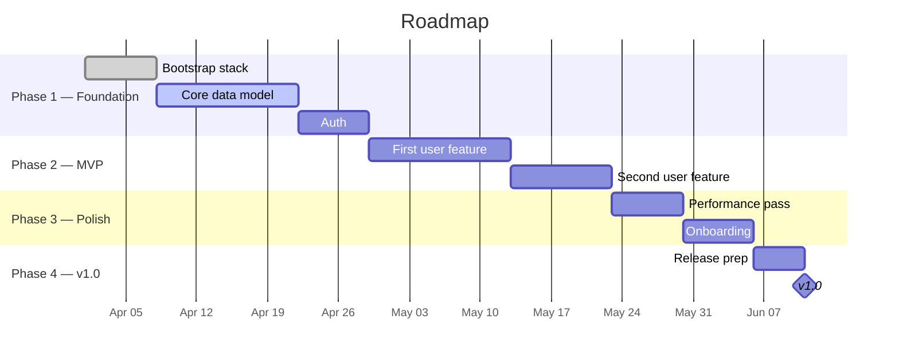

# Roadmap & phases

Visual timeline of where we are, what's coming, and **what you can go test as a user from each phase**. Updated by the agent as phases progress.

<!--
Roughly 4-6 phases, 2-4 weeks each for solo+agent.
Each phase produces something testable end-to-end before moving on.
The agent maintains the "Where we are now" block, the Gantt chart,
and the per-phase status / checkbox state. The human edits phase
names and "user-testable" descriptions.
-->

## Where we are now

| | |
|---|---|
| **Current phase** | _Phase 1 — Foundation_ |
| **Phase started** | YYYY-MM-DD |
| **Estimated phase completion** | YYYY-MM-DD (≈X days) |
| **Estimated v1.0 release** | YYYY-MM-DD |
| **Velocity** | _N PRs/week (rolling 14d)_ |

> Estimated dates come from linear extrapolation of merged-PR velocity. They shift as work lands; treat them as forecasts, not promises.

## Timeline

<!--
Mermaid Gantt status keywords:
  done    — completed chunks (grey-green)
  active  — currently in progress (blue, pulsing)
  crit    — critical path (red border)
  (none)  — planned (light grey)
The `todayMarker on` line draws a vertical "you are here" line.
-->

## Phases

### Phase 1 — Foundation

**Status:** 🚧 in progress
**Target:** YYYY-MM-DD

**What you can test as a user when this phase ships:**
- _e.g., sign up, log in, see an empty dashboard_

**Done when:**
- [ ]
- [ ]
- [ ]

### Phase 2 — MVP

**Status:** 📋 planned
**Target:** YYYY-MM-DD

**What you can test as a user when this phase ships:**
- _e.g., upload your first item, see it appear in the list_

**Done when:**
- [ ]
- [ ]

### Phase 3 — Polish

**Status:** 📋 planned
**Target:** YYYY-MM-DD

**What you can test as a user when this phase ships:**
- _e.g., the app feels fast; first-run flow guides you through_

**Done when:**
- [ ]
- [ ]

### Phase 4 — v1.0

**Status:** 📋 planned
**Target:** YYYY-MM-DD

**What you can test as a user when this phase ships:**
- _the full v1.0 experience — what should the launch demo look like?_

**Done when:**
- [ ]
- [ ]

## Status legend

- ✅ shipped
- 🚧 in progress
- 📋 planned
- ⏸ blocked / needs-decision
- ❌ dropped

## Sequencing rule

<!-- The one thing that must land before everything else. -->

## How this file is maintained

- The agent updates the **Where we are now** block, phase **Status**, and **Done when** checkboxes after each merge.
- The agent regenerates the Mermaid Gantt when a chunk finishes or estimates shift by more than 3 days.
- The "What you can test as a user" lines are written by the human; the agent only flips them between past and future tense as phases ship.
- Velocity is computed weekly from merged PR count.
